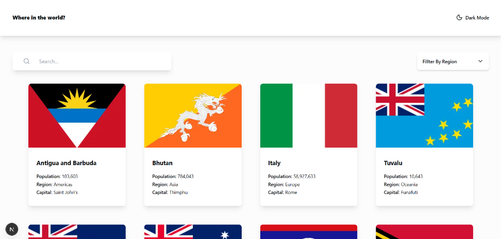

# REST Countries API with Color Theme Switcher



## 🔗 Links

- <a href="https://your-project.pages.dev"></a>
- **Frontend Mentor Solution:** [View Solution](https://www.frontendmentor.io/challenges/rest-countries-api-with-color-theme-switcher-5cacc469fec04111f7b848ca)

## 🌍 Overview

This is a comprehensive **Countries Explorer** application built with **Next.js 15**, **React 19**, and **Tailwind CSS v4**. It allows users to browse information about every country in the world, integrating with the [REST Countries API](https://restcountries.com/).

This project is a solution to the [REST Countries API with color theme switcher challenge on Frontend Mentor](https://www.frontendmentor.io/challenges/rest-countries-api-with-color-theme-switcher-5cacc469fec04111f7b848ca). Frontend Mentor challenges help you improve your coding skills by building realistic projects.

The project focuses on a premium user experience, featuring dynamic themes (Dark/Light), responsive design, and robust search/filtering capabilities.

## ✨ Features

- **See all countries** from the API on the homepage
- **Search for a country** using an `input` field
- **Filter countries** by region
- **Click on a country** to see more detailed information on a separate page
- **Toggle** the color scheme between light and dark mode
- **Responsive Design** optimized for Mobile, Tablet, and Desktop
- **SEO Optimized** with dynamic metadata and Open Graph tags

## 🛠️ Tech Stack

- **Framework:** [Next.js 16 (App Router)](https://nextjs.org/)
- **Library:** [React 19](https://react.dev/)
- **Styling:** [Tailwind CSS v4](https://tailwindcss.com/)
- **Icons:** [Lucide React](https://lucide.dev/)
- **Typography:** Nunito Sans (via `next/font`)
- **State Management:** React Hooks
- **Data Fetching:** Server Components

## 🚀 Getting Started

### Prerequisites

Make sure you have Node.js installed on your machine.

### Installation

1. Clone the repository:

   ```bash
   git clone https://github.com/yourusername/rest-countries-api.git
   ```

2. Navigate into the project directory:

   ```bash
   cd rest-countries-api-with-color-theme-switcher
   ```

3. Install dependencies:

   ```bash
   npm install
   # or
   pnpm install
   ```

4. Run the development server:

   ```bash
   npm run dev
   # or
   pnpm dev
   ```

## 📄 License

This project is open source and available under the information provided in the repository.
